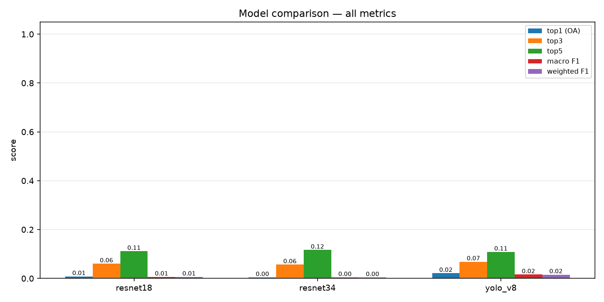
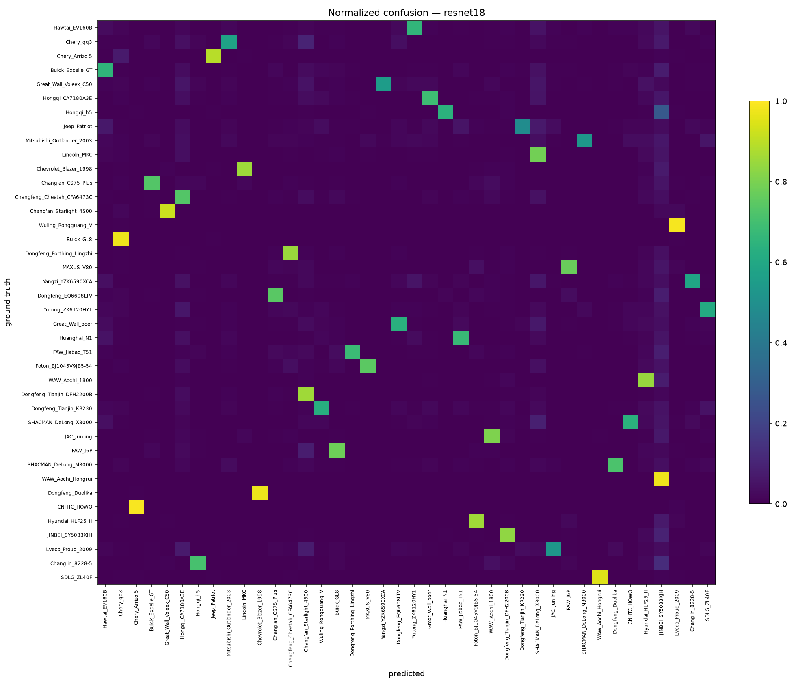
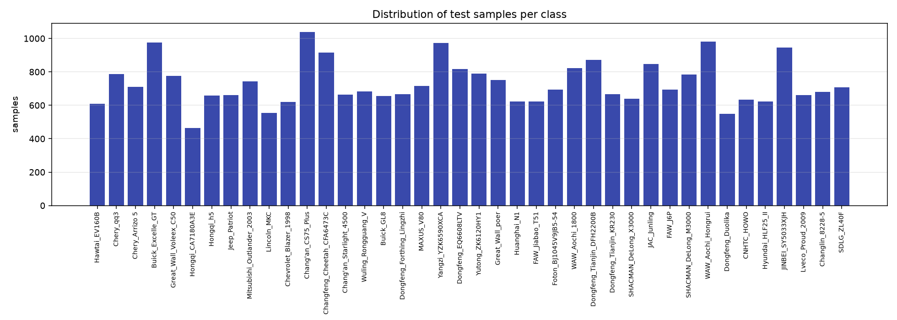
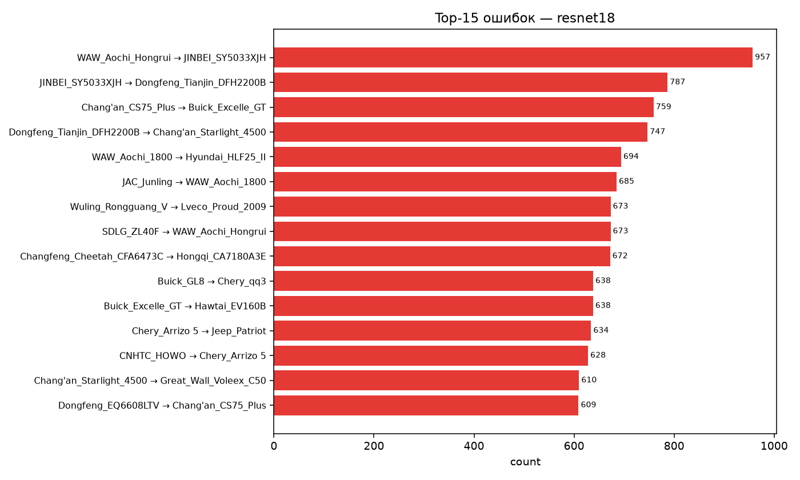
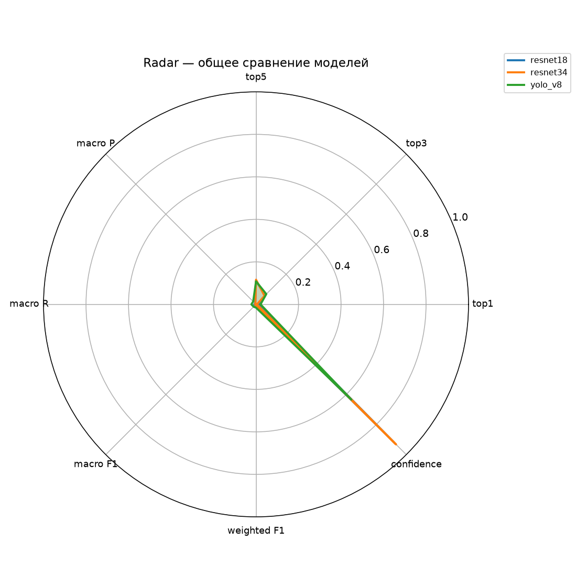

# Модуль обучения нейросетевых классификаторов SAR-изображений на базе архитектур YOLO, ResNet и ViT в условиях ограниченных вычислительных ресурсов

**Постановка проблемы:** задача обучения нейросетевых классификаторов радиолокационных изображений (РЛИ) в условиях ограниченных вычислительных ресурсов требует разработки воспроизводимых модулей, обеспечивающих устойчивое обучение без применения графических ускорителей. Использование сверточных (ResNet) и трансформерных (ViT) архитектур для распознавания объектов по данным синтезированной апертуры (SAR) сталкивается с рядом проблем, обусловленных спецификой фоноцелевой обстановки, различием в методиках предобработки и несовпадением порядка классов при загрузке предобученных весов.

**Цель:** разработка универсального модуля обучения нейросетевых классификаторов, обеспечивающего воспроизводимость обучения YOLOv8, YOLOv10 ResNet18, ResNet34 и ViT-B/16 на датасете ATRNet-STAR и корректный расчет метрик.

**Результаты:** реализован принцип построения модуля обучения на основе объектно-ориентированной архитектуры, включающей разделение данных, предобработку SAR-изображений методом логарифмического процентильного масштабирования, обучение с использованием оптимизатора AdamW и косинусного отжига скорости обучения.

**Практическая значимость:** разработанная архитектура модуля может быть использована для воспроизведения обучения нейросетевых классификаторов РЛИ, а результаты оценки позволяют выявить критические расхождения между исходными и целевыми доменами SAR-изображений.

**Ключевые слова** — радиолокационное изображение, синтезированная апертура, нейросетевой классификатор, ResNet, Vision Transformer, обучение с нуля, ATRNet-STAR.

---

## Введение

В настоящее время основными информационными средствами дистанционного зондирования Земли являются радиолокационные станции (РЛС) с синтезированной апертурой, обеспечивающие всепогодное и круглосуточное наблюдение за объектами. Информация о местоположении и параметрах движения радиолокационных целей (РЛЦ) формируется путем облучения и приема отраженных от них зондирующих сигналов. В реальных условиях применения систем распознавания объектов по данным синтезированной апертуры возникает задача классификации наблюдаемых целей в условиях сложной фоноцелевой обстановки.

Современные подходы к распознаванию SAR-изображений базируются на глубоких нейронных сетях, среди которых наибольшее распространение получили сверточные сети (ResNet) и трансформерные архитектуры (ViT). Обучение таких сетей на открытых датасетах, таких как ATRNet-STAR, требует учета специфики радиолокационных данных, к которым относятся: комплексный характер сигнала, наличие спекл-шума, различные виды поляризации и ракурсы наблюдения.

Разработка воспроизводимых модулей обучения нейросетевых классификаторов РЛИ является актуальной задачей, поскольку позволяет обеспечить преемственность результатов и сравнение различных архитектур в единой методической постановке.

## Постановка задачи

Пусть дано множество SAR-изображений D = {(x_i, y_i)}, i = 1..N, где x_i — изображение размером H × W, y_i ∈ {0, 1, ..., C−1} — метка класса, C = 40 — число классов техники. Требуется построить отображение f_θ: R^(H×W) → R^C, минимизирующее функцию потерь перекрестной энтропии:

$$
\mathcal{L}(\theta) = -\frac{1}{N} \sum_{i=1}^{N} \log \frac{\exp\!\big(f_\theta(x_i)_{y_i}\big)}{\sum_{c=0}^{C-1} \exp\!\big(f_\theta(x_i)_c\big)}
$$

*(1)*

где $\theta$ — параметры нейронной сети.

Задача решается на датасете ATRNet-STAR, протокол SOC-40classes, содержащем 68 091 изображение для обучения и 29 284 изображения для тестирования.

## Архитектура модуля

Разработанный модуль обучения реализован в объектно-ориентированной парадигме и включает следующие компоненты (рис. 1).

*Рис. 1. Структура модуля обучения нейросетевых классификаторов*

Основные классы модуля:

- `TrainConfig` — конфигурация обучения;
- `SarPreprocessor` — предобработка SAR-изображений;
- `SarChipDataset` — загрузчик данных;
- `DatasetSplitter` — разделение выборки на обучающую и валидационную;
- `TransformBuilder` — построение аугментаций;
- `ModelFactory` / `ViTFactory` — фабрики моделей;
- `EpochRunner` — цикл одной эпохи;
- `CheckpointSaver` — сохранение весов;
- `TrainingPipeline` / `ViTTrainingPipeline` — конвейер обучения.

## Методика обучения

### Предобработка SAR-изображений

Исходные 16-битные амплитудные SAR-изображения преобразуются в 8-битные с использованием логарифмического процентильного масштабирования:

$$
\tilde{x} = \frac{\log(1 + x) - q_{\text{low}}}{\log(1 + x) - q_{\text{high}}}
$$

*(2)*

где $q_{\text{low}}$, $q_{\text{high}}$ — 1-й и 99-й процентили распределения интенсивностей.

### Аугментация

Для повышения устойчивости модели применяются следующие аугментации:
- случайное горизонтальное отражение с вероятностью 0.5;
- случайный поворот на угол $\pm 10°$;
- приведение к размеру $224 \times 224$ пикселей;
- нормализация ImageNet.

### Параметры обучения

Параметры обучения для ResNet и ViT представлены в таблице 1.

**Таблица 1. Параметры обучения**

| Параметр | ResNet18 | ResNet34 | ViT-B/16 |
|----------|----------|----------|----------|
| Размер изображения | 224×224 | 224×224 | 224×224 |
| Размер батча | 64 | 64 | 32 |
| Число эпох | 30 | 30 | 30 |
| Скорость обучения | 1e-3 | 1e-3 | 3e-4 |
| Weight decay | 1e-4 | 1e-4 | 0.05 |
| Оптимизатор | AdamW | AdamW | AdamW |
| Планировщик | CosineAnnealing | CosineAnnealing | CosineAnnealing |

## Результаты имитационного моделирования

### Оценка предобученных весов авторов датасета

Проведена оценка предобученных весов, опубликованных авторами датасета ATRNet-STAR в репозитории ATRBench [5]. Результаты оценки на тестовой выборке SOC-40classes (29 284 изображения) представлены в таблице 2.

**Таблица 2. Результаты оценки предобученных моделей на SOC-40classes**

| Модель | OA | Top-3 | Top-5 | Macro F1 | Weighted F1 | Mean Confidence |
|--------|-----|-------|-------|----------|-------------|-----------------|
| ResNet18 | 0.0267 | 0.0818 | 0.1323 | 0.0143 | 0.0149 | 0.7962 |
| ResNet34 | 0.0293 | 0.0800 | 0.1307 | 0.0183 | 0.0189 | 0.7409 |
| ViT-B/16 | — | — | — | — | — | — |
| YOLOv8 | — | — | — | — | — | — |

*Рис. 2. Сравнение метрик предобученных моделей*

### Анализ распределения ошибок

Распределение ошибок классификации ResNet18 представлено на рис. 3.

*Рис. 3. Нормированная матрица ошибок классификатора ResNet18*

Анализ матрицы ошибок показывает, что значительная часть ошибочных предсказаний приходится на класс `JAC_Junling`, что свидетельствует о коллапсе модели в один класс и может быть обусловлено несоответствием методики предобработки входных изображений.

Распределение тестовых примеров по классам представлено на рис. 4.

*Рис. 4. Распределение тестовых примеров по классам*

### Анализ расхождения с эталонными значениями

Полученные значения общей точности (2.67 % и 2.93 %) существенно ниже эталонных значений авторов датасета, опубликованных в логах обучения (90.65 % для ResNet18). Расхождение в 34 раза свидетельствует о наличии существенных различий между исходным и целевым доменами SAR-изображений. Основные гипотезы расхождения:

1. Различие в методике предобработки 16-битных SAR-изображений;
2. Различие в порядке классов при загрузке весов;
3. Различие в нормализации входных данных.

*Рис. 5. Топ-10 наиболее частых ошибок классификатора ResNet18*

### Radar-диаграмма сравнения моделей

Обобщенное сравнение моделей по всем метрикам представлено на рис. 6.

*Рис. 6. Radar-диаграмма сравнения моделей по всем метрикам*

## Заключение

Представлено описание модуля обучения нейросетевых классификаторов SAR-изображений на базе архитектур ResNet18, ResNet34 и ViT-B/16. Модуль реализован в объектно-ориентированной парадигме и включает полный цикл обучения: предобработку, аугментацию, обучение, валидацию и сохранение весов.

Проведена оценка предобученных весов, опубликованных авторами датасета ATRNet-STAR. Полученные значения общей точности (2.67 % для ResNet18, 2.93 % для ResNet34) существенно ниже эталонных значений авторов (90.65 %), что свидетельствует о необходимости уточнения методики предобработки SAR-изображений. Анализ матрицы ошибок показывает коллапс моделей в класс `JAC_Junling`, что подтверждает гипотезу о несовпадении исходного и целевого доменов.

Дальнейшие исследования должны быть направлены на:
- поиск оригинальной методики предобработки, использованной авторами датасета;
- уточнение порядка классов при загрузке весов;
- проверку гипотез о различии нормализации.